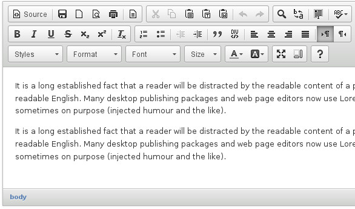

Django CKEd
===========

**CKEditor and elFinder integration for Django Framework.**

Provides a ``RichTextField`` and ``CKEditorWidget`` with upload and browse support.

      CKEditor widget

.. figure:: docs/_static/img/elfinder.jpg
      :align: center
      :alt: elFinder widget

      elFinder widget

**django-cked** works with Django 2.2+ and Python 3.6+

Installation and configuration
------------------------------

See `setup part`_ in documentation.

.. _setup part: https://django-cked.readthedocs.io/en/latest/setup.html

Usage
-----

See `usage part`_ in documentation.

.. _usage part: https://django-cked.readthedocs.io/en/latest/usage.html

Authors
-------

See `authors link`_ in documentation.

.. _authors link: AUTHORS.rst

License
-------

Licensed under BSD license. See `license link`_ in documentation.

.. _license link: LICENSE.rst

