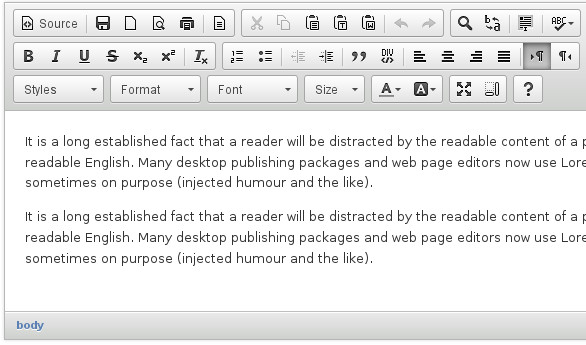
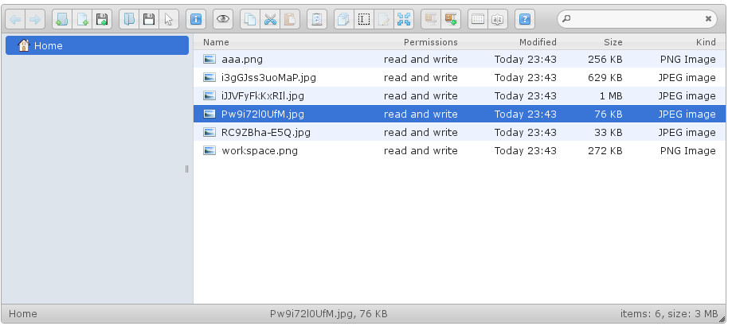

.. django-cked documentation master file, created by
   sphinx-quickstart on Thu Jun  3 14:34:38 2021.
   You can adapt this file completely to your liking, but it should at least
   contain the root `toctree` directive.

django-cked
===========

**CKEditor and elFinder integration for Django Framework.**

Provides a ``RichTextField`` and ``CKEditorWidget`` with upload and browse support.

      CKEditor widget

      elFinder widget

**django-cked** works with Django 2.2+ and Python 3.6+

.. toctree::
   :maxdepth: 2
   :caption: Contents:

   setup
   usage
   versions

Indices and tables
==================

* :ref:`genindex`
* :ref:`modindex`
* :ref:`search`
